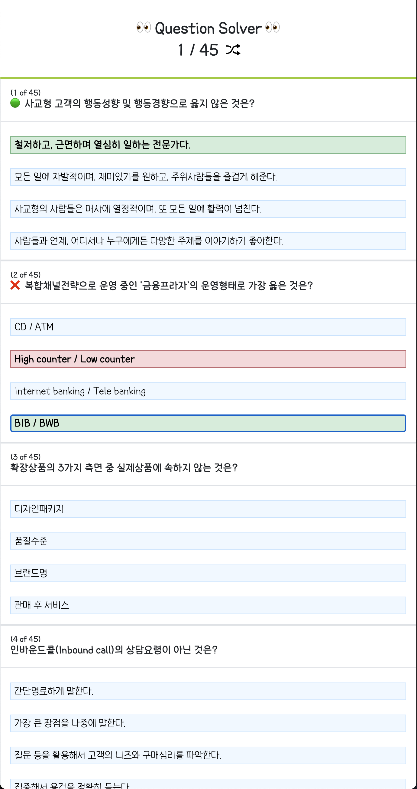

<!-- 로고 -->

---

<div style="text-align: center">

  <a href="https://github.com/githong-kr/question-solver">
    
  </a>

### question-solver

기출 문제의 순서를 Shuffle 하여 반복 학습할 수 있는 도구

</div>

---

<!-- TABLE OF CONTENTS -->
<details open="open">
  <summary>목차</summary>

> ### [1. 개요](#개요)
>
> ### [2. 필요 구성](#필요-구성)
>
> ### [3. 개발 스펙](#개발-스펙)
>
> ### [4. 스크린샷](#스크린샷)
>
> ### [5. 추가예정](#추가예정)

</details>

---

<!-- 개요 -->

## 개요

기출 문제를 구글 스프레드시트에 등록하여 풀이해볼 수 있습니다.

매 새로고침마다 문제와 보기의 순서가 Shuffle 됩니다.

---

---

<!-- 필요 구성 -->

## 필요 구성

### 1. credentials.json

- 구글스프레드시트 API 권한이 있는 프로젝트 생성
- 아래 양식의 .json 파일 다운로드 및 루트 경로에 위치

```
{
  "client_id": "",
  "project_id": "",
  "auth_uri": "",
  "token_uri": "",
  "auth_provider_x509_cert_url": "",
  "client_secret": "",
  "redirect_uris": [""]
}
```

### 2. .env

- 스프레드시트의 키값을 뜻하는 SPREAD_SHEET_KEY 변수 필요

---

<!-- 개발 스펙 -->

## 개발 스펙

> - Next.js ( v11.1.2 )
> - googleapis ( v89.0.0 )
> - Redux ( v4.1.1 )
> - Styled-Components ( v5.3.3 )

---

<!-- 스크린샷 -->

## 스크린샷

### 문제 풀이 화면



<!-- 추가예정 -->

## 추가예정

- 조금 더 많은 종류의 기출 문제를 담기 위해 카테고리 페이지 만들기
- 틀린 문제만 모아서 다시 풀 수 있는 기능 만들기
- Oauth 등을 활용하여 회원 관리하기 ( DB 연동 필요 )
- 각 회원 별 기출 문제 풀이 내역 저장 및 시각화 하기
- 기출 문제 수집 자동화 구상하여 적용하기
